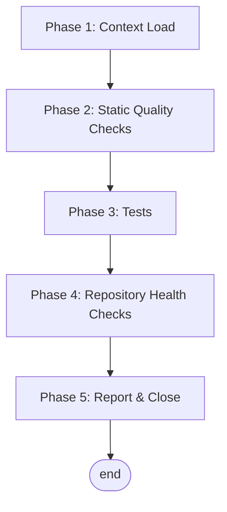

# Housekeeping Workflow

This file is the per-repository instance of the `HOUSEKEEPING_TEMPLATE.md` pattern. 

The workflow covers four concerns regardless of stack: (1) static quality of the codebase, (2) unit and integration test correctness, (3) repository-level health, and (4) an append-only audit trail in this file. Run it periodically or after any significant batch of changes.

**Execution model:** sequential — each phase has an explicit exit criterion and a remediation step.

> **Tip:** You can bundle the deterministic static quality, testing, and health checks of this protocol into a single shell script (e.g. `bin/housekeeping-checks.sh`) to execute the batch with one command, speeding up the housekeeping passes by reducing agent tool calls.

**Prerequisites:**
- Read access to the project's tooling configuration.
- `cps_admin_mcp` connected, for capturing significant agent sessions and deferred work.

---

## Flow



Pure sequential — no branches, no loops, no HITL gates.

---

## Phase 1 — Context Load

**Goal:** Identify the stack, tooling, and conventions of this repository before running any check.

### Step 1 — Discover the toolchain

The checks have been bundled into `bin/housekeeping-checks.sh`.

### Step 2 — Read the prior baseline

Read the "Latest Report" section at the bottom of this file.

---

## Phase 2 — Static Quality Checks

**Goal:** Verify the codebase is clean before exercising it.

### Step 1 — Format check

```bash
n/a
```

### Step 2 — Lint

```bash
n/a
```

### Step 3 — Type check (if applicable)

```bash
n/a
```

---

## Phase 3 — Tests

**Goal:** Verify behavior is unbroken and the test suite has not silently shrunk.

### Step 1 — Unit tests

```bash
.venv/bin/pytest adk_harness/
```

### Step 2 — Integration / end-to-end tests (if separated)

```bash
n/a
```

---

## Phase 4 — Repository Health Checks

**Goal:** Catch slow-burning issues that lint and tests do not surface.

### Step 1 — Dependency drift

```bash
n/a
```

### Step 2 — Dead code / unused exports

```bash
n/a
```

### Step 3 — Build smoke

```bash
n/a
```

---

## Phase 5 — Report & Close

**Goal:** Leave an auditable trail so the next housekeeping run has a baseline to compare against.

### Step 1 — Append a new "Latest Report" (compact shape)

Replace the prior `## Latest Report` block with a new one using the compact-metrics shape at the bottom of this file.

### Step 2 — Archive this run's report

Append *this* run's entry to `housekeeping_log.jsonl`.

### Step 3 — File follow-ups

If anything was found and not fixed, file it as a task in the store.

### Step 4 — Bump `last_checked`

Update the `last_checked` field in this file's metadata header.

---

## Quick Reference — Housekeeping Checklist

```text
[ ] Phase 1: Toolchain identified, prior baseline read
[ ] Phase 2: Format / lint / type checks — clean
[ ] Phase 3: Unit + integration tests — green; counts steady or improving
[ ] Phase 4: Dependency / dead-code / build / docs — no surprising drift
[ ] Phase 5: New compact-shape Latest Report appended
```

---

## Latest Report

**Date:** 2026-08-21
**Trigger:** Updated ADK Harness architecture to Five-Pillar layout; added `read_skill` abstraction and tests.

```yaml
format:        n/a
lint:          n/a
types:         n/a
tests:         { passed: 86, failed: 0, skipped: 0 }
integration:   n/a
dependencies:  n/a
dead_code:     n/a
build:         n/a
docs:          ok
```
