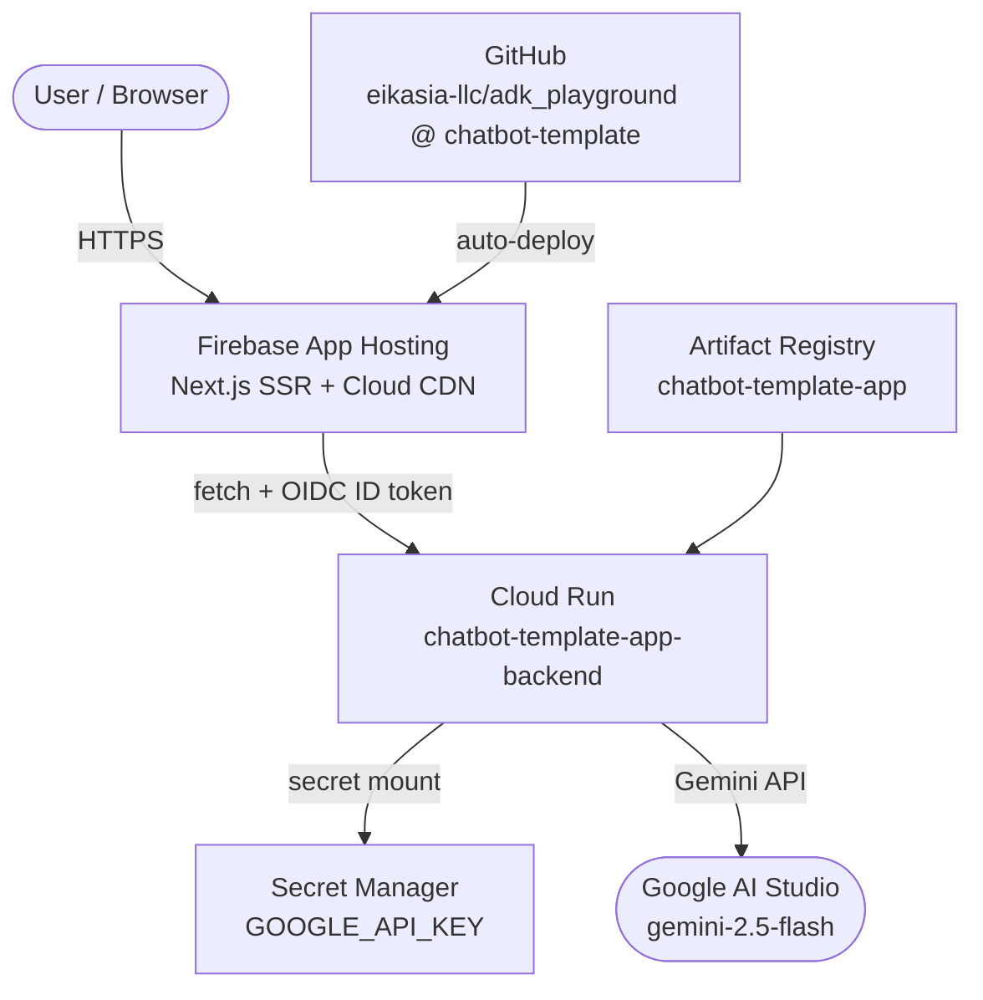

# Cloud Infrastructure: Chatbot Template

This reference describes the complete cloud infrastructure for the Chatbot Template application: a FastAPI/ADK backend on Cloud Run (IAM-only authentication), a Next.js SSR frontend on Firebase App Hosting with GitHub auto-deploy, a Secret Manager-mounted Gemini API key, and Artifact Registry for Docker image storage. It covers the OIDC-based auth flow (browser → Firebase App Hosting → OIDC token → Cloud Run backend), all component roles, IAM bindings, and key design decisions including the org-root project placement constraint. Reach for this to understand the architecture. For day-to-day operational procedures such as deployments, log reading, and cost management, see `INFRASTRUCTURE_CHATBOT_TEMPLATE_SKILL.md`.

## Quick Facts

| Item | Value |
| :--- | :--- |
| **App name** | Chatbot Template (`chatbot_template`) |
| **GCP project ID** | `chatbot-template-eikasia` (the bare `chatbot-template` was globally taken; fallback used per plan) |
| **GCP project number** | `207274917577` |
| **Org placement** | Org root `eikasia.com` (`908544520770`) — no folder. *(Initially placed in folder `chatbot-template` `folders/878080533360`; moved to org root on 2026-04-07 because the `firebase init apphosting` picker does not surface projects nested in folders. Folder deleted.)* |
| **Billing account** | `01983A-488BFC-C8951C` (same as `eikasia-ops`) |
| **Region** | `us-central1` |
| **Source repo** | `https://github.com/eikasia-llc/adk_playground`, root `chatbot_template/` |
| **Production branch** | `chatbot-template` (App Hosting auto-deploy + backend `deploy.sh` source). `main` is unaffected by this app's lifecycle. |
| **Backend service** | `chatbot-template-app-backend` (Cloud Run, IAM-only) |
| **Frontend service** | Firebase App Hosting backend (Next.js SSR, GitHub auto-deploy) |
| **Artifact Registry repo** | `chatbot-template-app` (`us-central1`, Docker) |
| **Runtime SA** | `chatbot-template-app-sa@chatbot-template-eikasia.iam.gserviceaccount.com` |
| **Secrets** | `GOOGLE_API_KEY` (Secret Manager) |
| **Logging** | Cloud Logging, minimum severity `WARNING` per cost policy |
| **Networking** | Isolated project, default VPC, Private Google Access enabled, **no Shared VPC**, **no VPC peering**, **no Serverless VPC connector** |
| **Gemini access** | AI Studio API key (permitted alternative to Vertex AI per `INFRASTRUCTURE_DEFINITIONS_REF.md`) |
| **Firebase Web App ID** | `1:207274917577:web:cc1628d5f27f10a31f1718` |
| **App Hosting GitHub connection** | `apphosting-github-conn-ytk3a8m` |

## Architecture



**Auth flow**: the browser never calls Cloud Run directly. The Next.js server (running inside Firebase App Hosting's managed Cloud Run) mints an OIDC ID token via the metadata server for each backend call, using `google-auth-library`. The App Hosting runtime service account holds `roles/run.invoker` on `chatbot-template-app-backend`. The backend is deployed with `--no-allow-unauthenticated`.

## Component Enumeration

| Component | Service | Purpose |
| :--- | :--- | :--- |
| **Backend Compute** | Cloud Run | Runs the FastAPI/ADK service exposing `/chat`, `/stream`, `/health`. IAM-only access. |
| **Frontend Compute** | Firebase App Hosting (managed Cloud Run + Cloud CDN) | Runs the Next.js 14 SSR app and proxies backend calls server-side. |
| **Image Registry** | Artifact Registry | Stores backend Docker images. |
| **Secret Management** | Secret Manager | Stores `GOOGLE_API_KEY` for Gemini access. |
| **Build** | Cloud Build | Backend image build pipeline. Frontend builds via App Hosting buildpacks on git push. |
| **Source** | GitHub (`eikasia-llc/adk_playground`) | Single source of truth. App Hosting auto-deploys from `chatbot-template` branch, root `chatbot_template/frontend/`. |
| **Logging** | Cloud Logging | Severity floor `WARNING`. |

Both backend and frontend are Cloud Run services under the hood but live in different IAM perimeters. The App Hosting backend's runtime SA is what receives `roles/run.invoker` on the IAM-only application backend — that grant is the bridge that allows the Next.js server-side proxy routes (`/api/chat`, `/api/stream`) to call FastAPI.

## Enabled APIs

Explicitly enabled (14): `run`, `artifactregistry`, `cloudbuild`, `secretmanager`, `iam`, `iamcredentials`, `logging`, `aiplatform`, `firebase`, `firebasehosting`, `firebaseapphosting`, `cloudresourcemanager`, `serviceusage`, `compute`.

Total enabled after transitive dependencies: **46**.

## Branch Strategy

**Production deploys are sourced exclusively from the `chatbot-template` branch** of `eikasia-llc/adk_playground`. This applies to both surfaces:

- **Frontend (Firebase App Hosting)**: the App Hosting backend is configured to watch the `chatbot-template` branch. Every push to that branch (touching `chatbot_template/frontend/`) triggers a buildpack rollout.
- **Backend (Cloud Run)**: `deploy.sh` (manual or via Cloud Build) refuses to run unless the current git branch is `chatbot-template`. There is no automatic backend trigger; deploys are intentional.

`main` is **not** a deploy source for this app. It exists for the wider `adk_playground` workspace and is not coupled to the chatbot-template lifecycle. Routine work flow:

1. Create a topic branch off `chatbot-template` for any change.
2. Open PR into `chatbot-template`.
3. Merge → frontend auto-deploys; backend deploys when an operator runs `deploy.sh`.

**Verification (Phase 4.5.8, 2026-04-13)**: App Hosting latest build confirmed on branch `chatbot-template` (commit `b31e6c5`). `deploy-backend.sh` branch guard verified (`PROD_BRANCH="chatbot-template"`). Status: **verified**.

## Design Decisions

- **Isolated GCP project, not Shared VPC service project.** Rationale: no cross-project calls needed for this app, simpler IAM blast radius, single-tenant template. Future migration to Shared VPC is non-destructive if requirements change.
- **Firebase App Hosting (not static Firebase Hosting).** The frontend is Next.js 14 with App Router and SSR. Static `next export` would lose SSR/route handlers, which we need for the IAM-only backend proxy pattern. App Hosting at this scale (~2 users/week) costs effectively the same as plain Cloud Run (~$0.01–0.05/mo). See Phase 6 of the provisioning plan for the corresponding policy update to `INFRASTRUCTURE_DEFINITIONS_REF.md`.
- **AI Studio API key (not Vertex AI).** Both are permitted. AI Studio chosen for v1: simpler auth (single API key in Secret Manager), no Vertex quota onboarding, lower cost at low volume. Migration to Vertex AI is a small backend change.
- **IAM-only backend with Next.js server-side proxy.** No browser ever holds backend credentials; all backend calls flow through `/api/chat` and `/api/stream` route handlers in the Next.js server. CORS on the backend stays locked to nothing.

## Service URLs

| Surface | URL |
| :--- | :--- |
| **Frontend (end user)** | `https://chatbot-template-app--chatbot-template-eikasia.us-central1.hosted.app` |
| **Backend (IAM-only)** | `https://chatbot-template-app-backend-207274917577.us-central1.run.app` |

## Service Accounts

| SA | Email | Purpose |
| :--- | :--- | :--- |
| Backend runtime | `chatbot-template-app-sa@chatbot-template-eikasia.iam.gserviceaccount.com` | Cloud Run backend identity. Holds `roles/secretmanager.secretAccessor`, `roles/logging.logWriter`, `roles/artifactregistry.reader`. |
| App Hosting compute | `firebase-app-hosting-compute@chatbot-template-eikasia.iam.gserviceaccount.com` | Frontend Cloud Run identity. Holds `roles/run.invoker` on `chatbot-template-app-backend`. |
| Firebase Admin SDK | `firebase-adminsdk-fbsvc@chatbot-template-eikasia.iam.gserviceaccount.com` | Auto-created when Firebase was added. |
| Default Compute | `207274917577-compute@developer.gserviceaccount.com` | Used by Cloud Build. Holds `roles/run.admin`, `roles/iam.serviceAccountUser`, `roles/artifactregistry.writer`, `roles/storage.admin`. |
| Legacy Cloud Build | `207274917577@cloudbuild.gserviceaccount.com` | Defensive grants for legacy Cloud Build flow: `roles/run.admin`, `roles/iam.serviceAccountUser`, `roles/artifactregistry.writer`, `roles/logging.logWriter`. |

## Backend Cloud Run Spec

| Item | Value |
| :--- | :--- |
| **Service name** | `chatbot-template-app-backend` |
| **minInstances** | 0 |
| **maxInstances** | 2 |
| **Memory** | 512Mi |
| **CPU** | 1 |
| **Concurrency** | 80 |
| **Image prefix** | `us-central1-docker.pkg.dev/chatbot-template-eikasia/chatbot-template-app/backend:<sha>` |
| **Labels** | `app=chatbot-template-app`, `managed-by=deploy-sh` |

## Deployment

See `INFRASTRUCTURE_CHATBOT_TEMPLATE_SKILL.md` → DEPLOY_SKILL section for the full runbook.

**Backend (Cloud Run)** — manual, intentional deploys only:

```bash
git checkout chatbot-template
./deploy-backend.sh
```

Builds via Cloud Build, pushes to Artifact Registry, deploys to Cloud Run. Script has a hard branch guard refusing any branch except `chatbot-template`.

**Frontend (Firebase App Hosting)** — automatic on push:

```bash
git checkout chatbot-template
git push origin chatbot-template
```

Every push touching `chatbot_template/frontend/` triggers an App Hosting buildpack rollout.

## Observability

See `INFRASTRUCTURE_CHATBOT_TEMPLATE_SKILL.md` → LOGS_SKILL section for detailed recipes.

- **Log sink**: `_Default` with exclusion `drop-below-warning` (`severity < WARNING`). Only WARNING+ entries are ingested per cost policy.
- **Backend logs**: `resource.type="cloud_run_revision" AND resource.labels.service_name="chatbot-template-app-backend"`.
- **Frontend logs**: `resource.type="cloud_run_revision" AND resource.labels.service_name="chatbot-template-app"`.

## Access

See `INFRASTRUCTURE_CHATBOT_TEMPLATE_SKILL.md` → CONSOLE_SKILL section for deep links and CLI recipes.

## Rollback

**Backend**: deploy a previous image tag:

```bash
gcloud run deploy chatbot-template-app-backend \
  --image=us-central1-docker.pkg.dev/chatbot-template-eikasia/chatbot-template-app/backend:<previous-tag> \
  --project=chatbot-template-eikasia --region=us-central1
```

**Frontend**: revert the commit on `chatbot-template` and push, or use App Hosting rollback:

```bash
# Option 1: git revert
git revert HEAD && git push origin chatbot-template

# Option 2: redeploy a previous Cloud Run revision (managed by App Hosting)
gcloud run services update-traffic chatbot-template-app \
  --to-revisions=<previous-revision>=100 \
  --project=chatbot-template-eikasia --region=us-central1
```

**Full project teardown** (soft-deletes for 30 days):

```bash
gcloud projects delete chatbot-template-eikasia
```

## Known Limitations

- **`InMemorySessionService`**: chat sessions are lost on Cloud Run cold starts and scale-to-zero. Acceptable for v1 (template). Persistent session storage (Firestore-backed `SessionService`) is a future enhancement.
- **No App Check / no rate limiting** at the App Hosting layer. Add before any public-facing rollout beyond the template phase.
